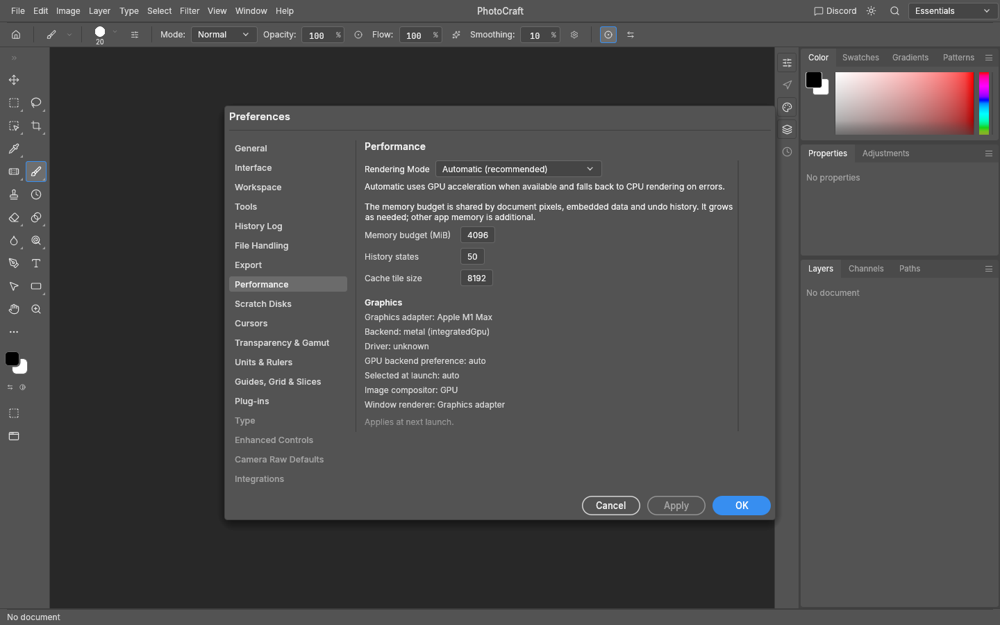

# Undo cache

PhotoCraft keeps current documents and adjacent undo/redo states in shared,
copy-on-write RAM. Older history spills to a session-private scratch directory
only under memory pressure. Defaults are **4096 MiB RAM** and **8192 MiB disk**
shared by the open documents in one Session. Neither limit reserves memory or
preallocates disk files. History States remains 50 per document by default.

Preferences → Performance sets the memory budget. Preferences → Scratch Disks
sets the disk budget and preferred paths; zero disk budget disables new spills.
The first enabled path is used, or the system temporary directory. Path changes
apply to the next cache session so existing history stays reachable. Budget
changes apply live; reducing disk capacity may retire oldest history states.
The web build remains RAM-only.

The memory budget measures unique managed document/history pixel payloads and
preserved shared blobs, not process RSS. Current documents, immediately adjacent
history, external snapshots, GPU textures, font data, metadata, filter working
buffers, and allocator overhead can exceed it. A current document is never
silently deleted to satisfy a cache setting. Crossing the RAM target starts
spilling toward a 90% low-water mark to avoid oscillating at the threshold.

## Storage and latency

- RAM snapshots retain existing COW tile sharing. Changes that share every
  payload with current/adjacent states do not trigger redundant scratch writes.
- One bounded worker writes cold snapshots; compression and file cleanup stay
  off the UI thread. Pending snapshots remain accounted as resident data.
- The existing native format writes complete metadata manifests and
  content-addressed, fast lossless zstd tiles/blobs. Unchanged objects are stored
  once across snapshots. Weak allocation caches avoid rehashing live shared
  tiles and reuse them on restoration, without retaining their pixels in RAM.
- Actual compressed objects and manifests count against the disk budget. A
  failed write never publishes a history snapshot. Retired snapshot leases queue
  garbage collection; shared files survive until their final reference expires.
- Current and immediate undo/redo states stay hot when resident. Loading an older
  cold state is synchronous and explicitly fallible. Immutable published files
  can be read without waiting on the writer lock. On a read/decode/hash error,
  the document and both history cursors remain unchanged and the command fails.
- Disk quota, slow-write backpressure or unavailable storage can shorten oldest chronological history;
  the current document and adjacent undo remain. Failures appear in the status
  area and through `Session::take_history_cache_notice()`.

Scratch storage is ephemeral, separate from [durable autosave/recovery](recovery.md). Recovery captures cold history handles and writes complete undo/redo checkpoints on its background worker. Normal session
shutdown cleans the private directory. A process crash can leave its temporary
directory behind; automatic crash-leftover cleanup is a follow-up, not permission
to delete another running application's files. Permissions/deletion failures
remain accounted and are reported.

Automation uses existing `prefs.set` / `prefs.get`:

```json
{"values":{"performance.memoryUsageMb":4096,"scratchDisks.budgetMb":8192}}
```

`session.inspect` reports actual resident payload bytes, compressed disk bytes,
configured budgets and worker activity. Existing undo, redo, Fade, History Brush,
Fill from History and Reselect preserve their command interfaces; cold restore
errors propagate rather than substituting current pixels.

## Research and implementation choice

[GEGL tile-cache controls](https://developer.gimp.org/api/gegl/property.Config.tile-cache-size.html)
and [swap compression](https://developer.gimp.org/api/gegl/property.Config.swap-compression.html)
support independently bounded RAM and compressed disk tiers.
[Linux zswap](https://www.kernel.org/doc/html/latest/admin-guide/mm/zswap.html)
provides a useful model for demand-grown storage and threshold hysteresis.
[SQLite atomic commit](https://www.sqlite.org/atomiccommit.html) illustrates why
incomplete writes must not become authoritative; no SQLite dependency is needed
for ephemeral immutable scratch objects.

A new LZ4 codec and per-operation replay were considered. Reusing PhotoCraft's
existing pure-Rust native format avoids a second document serializer and preserves
all masks, selections, patterns, video frames and embedded content. It also avoids
a layering violation: ops L2 depends only on an archive interface; engine L5
connects it to format L3. This is an incremental, correctness-first architecture,
not a claim of optimal latency. Files per object and synchronous cold restoration
remain opportunities for packed segments and bounded adjacent-state prefetch.
Benchmark codec and layout changes before selecting them.

## Validation and measurement

`cargo run --release -p photocraft-engine --example history_cache_bench -- --steps 12`
uses a deterministic 24 MP image, a deliberately constrained 128 MiB RAM target,
and compares disk-disabled history with the 8 GiB disk tier. It reports edit,
enqueue, worker-settle and hot/cold undo percentiles, retained steps and actual
RAM/disk payload bytes. Disk-disabled history retains fewer states; it is not an
equivalent-retention performance baseline or proof of a speedup.

Regression tests cover lazy allocation, cross-document sharing, quota rollback,
8/16/32f exact restoration, malformed scratch data, failed writes, no writer-lock
contention during cold reads or snapshot drops, count/budget reduction, redo
invalidation, close/purge cleanup and atomic command failure. The CI workload
publishes a reproducible report independently of the regular native/wasm tests.

Release-mode measurement on Ubuntu CI / Rust 1.99, 2026-10-06
([run](https://github.com/TheSeanLavery/photocraft/actions/runs/37552870516)):

| Metric | Disk disabled | 8 GiB disk tier |
|---|---:|---:|
| Undo steps retained | 1 | 12 (11 archived) |
| Resident managed payloads | 192 MiB | 192 MiB |
| Actual disk payloads + manifests | 0 | 7.36 MiB |
| Edit/enqueue overhead p50 / p95 | 0.265 / 8.585 ms | 0.207 / 0.231 ms |
| Background settle p50 / p95 | 0 / 0 ms | 246.374 / 295.409 ms |
| Cold undo p50 / p95 | unavailable | 37.759 / 47.645 ms |

The current document plus immediately adjacent undo state occupy 192 MiB, so the
128 MiB stress target is exceeded by pinned data even after eviction. Each edit
mutates the full image; the benchmark settles after each edit. The synthetic
repeated texture compresses unusually well. Actual photos, rapid consecutive
edits, larger embedded assets and slower disks need separate measurements; these
numbers do not certify UI latency or a hard process-memory ceiling.

Preferences verified offscreen on Apple M1 Max / Metal:




Coordinator verification: Rust 1.99 local tests pass (617 engine, 29 format,
16 history/ops, 554 UI; 13 existing ignored tests). Strict all-target Clippy for
these four crates passes. The adversarial command check and layering pass;
the dedicated release-mode workload and initial WebAssembly CI pass. Both
preference dialogs were rendered offscreen and visually inspected. Final
cross-platform/corpus CI is linked from the PR.
